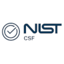
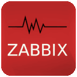
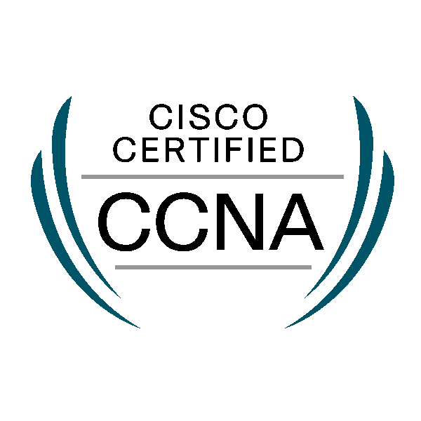

#  Welcome !

**SOC | Networking | Cybersecurity | Linux**

📧 [shiwantha.rodrigo.it@gmail.com](mailto:shiwantha.rodrigo.it@gmail.com)   
📞 [+94-770-858564](tel:+94770858564)  
🔗 [LinkedIn](https://www.linkedin.com/in/shiwantha-i-rodrigo/) | [GitHub](https://github.com/Shiwantha-I-Rodrigo) | [Portfolio](https://shiwantha-i-rodrigo.github.io/) 

<iframe src="https://tryhackme.com/api/v2/badges/public-profile?userPublicId=6818558" style='border:none;'></iframe>

---

## 📊 Professional Summary

Professional with hands-on experience supported by multiple industry certifications, Strong foundation in Linux systems, networking fundamentals, vulnerability assessment and incident response, with a strong background in software engineering. Passionate about monitoring, troubleshooting and securing systems and networks, with a focus on automation, log analysis and continuous learning.

---

## 🎯 Core Skills

Skilled in security operations, network and systems security and automation. Skilled in SIEM monitoring, incident response, IOC analysis, network traffic analysis, firewall and IDS/IPS management, Linux administration, system hardening, and scripting with Python and Bash. Proficient with tools like Splunk, Wireshark, tcpdump, and iptables, applying frameworks such as MITRE ATT&CK and NIST CSF to drive effective risk assessment and threat mitigation.

---

## 🎲 Personal Interests

- Cryptography  
- Game Theory Applications  
- Logical Paradoxes  
- Free & Open Source Software (FOSS) Development  

---

⭐ *Turning alerts into insights and coffee into code.* 

📬 Feel free to connect or collaborate!

---

 
  
 🎯 <strong>PROJECTS</strong>

   
  
<a href="https://github.com/Shiwantha-I-Rodrigo/watch_tower"> WATCH TOWER 🚨 : A SIEM project designed to capture, monitor and analyze network communications to detect security events.</a>

  
<a href="https://github.com/Shiwantha-I-Rodrigo/enigma"> ENIGMA 🔐 : A secure, deterministic password and two-factor authentication (2FA) generator.</a>

  
<a href="https://github.com/Shiwantha-I-Rodrigo/kgvh_2023"> KING GARDEN VIEW HOTEL WEBSITE 🏠 : Online room reservation and management platform for King Garden View Hotel.</a>

 

 
  
 📚 <b>TUTORIALS</b>

   
  
<a href="https://github.com/Shiwantha-I-Rodrigo/ghost_payload"> GHOST PAYLOAD 👻 : An Exploration of techniques for embedding and hiding executable payloads within various file formats.</a>

  
<a href="https://github.com/Shiwantha-I-Rodrigo/pancc"> PALO ALTO NETWORK CYBER SECURITY GUIDE 🎓</a>

  
<a href="https://github.com/Shiwantha-I-Rodrigo/gcc"> GOOGLE CYBERSECURITY PROFESIONAL CERTIFICATE GUIDE 🎓</a>

  
<a href="https://github.com/Shiwantha-I-Rodrigo/linux"> COMPTIA LINUX+ CERTIFICATION GUIDE 🎓</a>

  
<a href="https://github.com/Shiwantha-I-Rodrigo/ccna"> CISCO CERTIFIED NETWORK ASSOCIATE CERTIFICATION GUIDE 🎓</a>

 

 
  
 📝 <strong>BLOGS</strong>

   
  
<a href="https://github.com/Shiwantha-I-Rodrigo/homelab"> PERSONAL SOC/NOC HOME LAB BLOG 🌐</a>

 

 
  
 ☢️ <b>TECH STACK</b>

   
  <i>the friends I made along the way</i>
  

    
    
    
    
    
    
    
    
    
    
    
    
    
    
    
    
    
    
    
    
    
    
    
    
    
    
    
    
    
    
    
    
    
  

 

 
  
 🏆 <b>CERTIFICATIONS</b>

   
  

    
    
    
    
    
    
  

